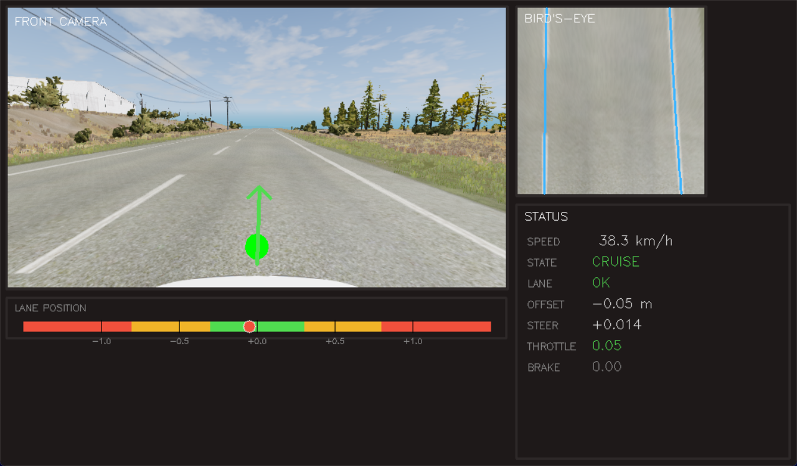
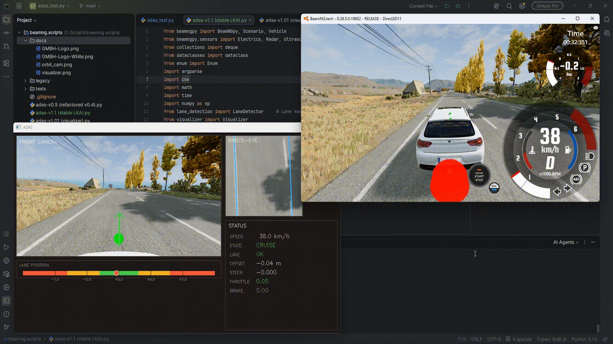

# ADAS Prototype — **ACC + AEB + LKA** in BeamNG.tech

[English](README.md) | [Русский (устарел)](README_RU.md)

A research prototype of an Advanced Driver Assistance System built on top of
[BeamNG.tech](https://documentation.beamng.com/beamng_tech/). The ego vehicle
keeps its lane via a forward-facing camera + classical CV pipeline, follows a
lead vehicle via radar-based ACC, and falls back to AEB or CREEP states for
emergency braking and slow approach scenarios.

**Status (v1.2):** Full ACC + AEB + LKA working end-to-end on
`automation_test_track` with an AI-driven lead vehicle.

**Note:** BeamNG.tech ships with a [built-in LKA module][beamng-lka]
and an AI driver. This project reimplements lane keeping and the longitudinal
control stack from scratch (camera → CV pipeline → state machine → controllers)
as a learning exercise — the goal was to build the full perception-to-actuation
stack, not just configure a black-box module.

[beamng-lka]: https://documentation.beamng.com/beamng_tech/adas_features/lane_keeping_assist/_index_en/

---

## Highlights:

| Metric | Value |
|---|---|
| Lane detection validity | **98%** of ticks on `automation_test_track` |
| Lane offset stdev | **4–7 cm** on straight sections (35 km/h) |
| Radar false-positive rate | **<1%** on empty road (vs ~94% before doppler filter) |
| Control loop frequency | **10 Hz** target / 10 Hz actual |
| Throttle smoothness | mean \|Δthrottle\| ≈ **0.025** per tick (slew-limited) |
| Steering smoothness | mean \|Δsteer\| ≈ **0.005** per tick |
| Unit tests | **22 passing** on pure control logic |

---

## Demo:



.gif)

The visualizer shows, in real time:
- Front camera with steering correction arrow
- Bird's-eye view with detected lane polynomials
- Status panel (speed, state, lane validity, offset, steering, throttle, brake)
- Lane position bar — color-coded zones (green / yellow / red) with the ego vehicle marker

Run with `python "adas-1.x" --visualize` to enable.

---

## Architecture:

```
                ┌─────────────────┐
                │  BeamNG.tech    │
                │   simulator     │
                └────────┬────────┘
                         │ sensors
        ┌────────────────┼─────────────────┐
        ▼                ▼                 ▼
   ┌─────────┐    ┌─────────────┐    ┌──────────┐
   │ Camera  │    │ Radar / US  │    │ State /  │
   │ 640×360 │    │   sensors   │    │ Electrics│
   └────┬────┘    └──────┬──────┘    └────┬─────┘
        ▼                ▼                 ▼
   ┌─────────┐    ┌─────────────┐    ┌──────────┐
   │  Lane   │    │ Distance,   │    │  Speed,  │
   │detection│    │ TTC,        │    │  pose    │
   │pipeline │    │ leader info │    │          │
   └────┬────┘    └──────┬──────┘    └─────┬────┘
        │                │                 │
        └────────────────┼─────────────────┘
                         ▼
                  ┌─────────────┐
                  │ Measurements│ (per-tick snapshot)
                  └──────┬──────┘
                         ▼
                  ┌─────────────┐
                  │   State     │  CRUISE/FOLLOW/AEB/
                  │   machine   │  CREEP/STOP
                  └──────┬──────┘
                         ▼
                  ┌─────────────┐
                  │  Per-state  │  PID + LPF + slew rate
                  │ controllers │  + gain scheduling
                  └──────┬──────┘
                         ▼
                 vehicle.control()
```

The system is split into clear layers:

- **Perception** — `lane_detection.py`: ROI → perspective transform (bird's-eye) →
  HLS binarization → sliding window → 2nd-degree polynomial fit → sanity checks →
  lane offset in meters. Radar filtering by elevation/azimuth/intensity and
  doppler (to ignore static obstacles).
- **Sensor fusion** (light) — `ADASController.measure()`: combines camera-based
  lane offset, lookahead offset, lane curvature, radar distance/doppler, and
  ultrasonic distance into a single `Measurements` snapshot.
- **State machine** — `next_state()` pure function: CRUISE / FOLLOW / AEB / CREEP / STOP
  with confirm-tick logic and hysteresis to avoid flapping.
- **Control** — `compute_steering()` (lookahead + PID + LPF + slew + inertia
  fallback) and per-state throttle/brake controllers, built on a generic
  `PIDController` with anti-windup and bounded output. Slew-rate limiting on
  throttle/brake for human-like smooth pedal movement.

---

## Lane keeping pipeline:

```
camera frame (RGB)
    │
    ▼
ROI crop (45–95% of frame height) — removes sky and hood
    │
    ▼
Perspective transform (calibrated SRC_POINTS_FRAC)
    │
    ▼  bird's-eye view (400×400)
HLS binarization (white + yellow ranges)
    │
    ▼
Sliding window or prior-based search
    │
    ▼
np.polyfit degree 2 — for each line
    │
    ▼
Sanity checks:
  - parallelism (a coeffs close enough)
  - lane width within [0.3×BEV, 1.5×BEV]
  - |offset| < lane_width / 2
  - |Δoffset| < MAX_JUMP between frames
    │
    ▼  if a line is missing/weak: fallback
       → reconstruct from the strong line + lane_width prior
    │
    ▼
lane_offset_m (signed: + = vehicle right of center)
+ lane_offset_ahead_m (lookahead, for predictive steering)
+ lane_curvature_r (radius, for curvature-based speed limiting)
```

The fallback was added after observing that the dashed center divider often
produces fewer pixels than the solid right edge — the detector keeps a smoothed
`lane_width_px_prior` and uses it to reconstruct the weaker line geometrically.

**Lookahead steering** computes offset not under the bumper but ~9 m ahead along
the polynomial. This gives the controller a head start on corners — steering
begins to turn before the vehicle enters the curve.

**Curvature-based speed limiting** computes the polynomial's radius of curvature
and derives a safe cornering speed via `v_max = sqrt(a_lat · R)` with
`a_lat = 3.0 m/s²`. On straights `R → ∞` and `target_speed` is unaffected; on
sharp turns it drops smoothly.

---

## Longitudinal control stack (ACC / AEB / CREEP):

### Radar filtering

The BeamNG radar returns ~3,000–10,000 ray hits per tick — not curated
detections. Two layers of filtering produce a single usable target:

1. **Geometric** — keep only rays within ±5° elevation, ±15° azimuth, intensity
   > Removes road surface, sky, and distant clutter.
2. **Kinematic (doppler)** — at `ego_speed > 1 m/s`, drop rays where
   `|doppler − ego_speed| < 2 m/s`. These are **static** objects (signs, poles,
   buildings) we don't want ACC to react to.

Before this filtering, `has_target=True` for **94%** of ticks on
`automation_test_track` even with no real vehicle ahead (poles and signs were
treated as stationary "leaders"). After: **<1%**.

### Leader tracking

The doppler filter has one failure mode: if a real leader suddenly stops, its
relative speed equals `ego_speed`, and the filter would mistakenly classify it
as a static object — exactly when we most need to detect it.

Solution: a lightweight tracker remembers the last accepted target's distance
and timestamp. If the doppler filter empties out within `TRACKING_TIMEOUT = 2 s`
of the last sighting, we look in the geometric-filtered (pre-doppler) set for a
point within ±5 m of the last distance and use it. This survives the moment
where a moving leader transitions to stopped without losing it.

### State machine

```
CRUISE  ←→  FOLLOW  ←→  AEB
                 ↓
              CREEP  →  STOP
```

- **CRUISE** — no target ahead, regulate to `TARGET_SPEED` with curvature-based limit.
- **FOLLOW** — target detected within `RADAR_DETECT_DIST = 90 m`. Cascade ACC:
  outer loop computes target speed from distance + leader speed, inner PI
  produces throttle/brake.
- **AEB** — TTC below threshold for `AEB_CONFIRM_TICKS = 2` consecutive ticks.
  Full brake until vehicle is stopped or TTC recovers.
- **CREEP** — slow approach to a stopped target. Custom state for stop-and-go
  traffic scenarios.
- **STOP** — terminal. Park brake engaged.

### CREEP — slow approach to a stopped target

CREEP activates when the radar sees a stationary target close (within
`CREEP_RADAR_DIST = 15 m`) and the ego is at low speed. Instead of holding
the brake forever (which would prevent natural traffic merging), CREEP runs a
small PI controller targeting ~5 km/h, inching forward while monitoring the
front ultrasonic sensor. When the gap closes to `CREEP_RADAR_STOP = 3.5 m`,
the state transitions to STOP.

This was something I wanted from a real ADAS — the smooth "follow the car ahead
in stop-and-go traffic" behavior — so I built it directly into the state machine
rather than approximating with a generic PID.

---

## Project evolution:

| Version | What changed | Key result                                                                    |
|---|---|-------------------------------------------------------------------------------|
| **v0.1–v0.2** (legacy) | First prototype, single `while True` loop on `tech_ground` map, ACC + AEB inline | It is kinda working, but it's harder to extend.                               |
| **v0.3–v0.4** (legacy) | State machine introduced, PD steering keeping `ego_x = 0` (world coordinate) | Worked, but locked to one map and spawn point.                                |
| **v0.5** | Refactor into classes, dataclasses, 22 unit tests, named constants in `Config` | Clean foundation. Same behavior, much easier to extend.                       |
| **v1.0** | Camera + lane detection pipeline + PID with LPF / slew rate / gain scheduling | **Lane keeping works.** 6.7 cm stdev at 35 km/h on straight road.             |
| **v1.0.1** | Real-time visualization in a separate window | Same behavior, but observable.                                                |
| **v1.1** | Radar properly configured (narrow FOV instead of default ±34°), doppler filter for static objects, leader tracking | **ACC (CRUISE) + LKA ** on `automation_test_track` with no problems.          |
| **v1.2** (current) | Lookahead steering, curvature-based speed limiting, inertia fallback on lane loss, throttle/brake slew rate, AI-driven lead vehicle test scenario | **Full end-to-end:** CRUISE → FOLLOW → CREEP working in a realistic scenario. |

---

## Notable engineering moments:

These are bugs and dead-ends worth describing — they shaped how the system
ended up being built.

### Steering sign — twice inverted

Early on, the PD controller used `error = ego_x` and worked, because on
`tech_ground` the vehicle spawned at world origin. Switching to lane-relative
control (`error = lane_offset_m`) and then to a new map flipped the effective
sign of feedback: the vehicle accelerated away from center instead of returning
to it. Diagnosis was done not by reasoning about coordinate frames, but by
looking at the CSV — `offset` and `steering` had the same sign across every
sample, which only happens with positive feedback. One minus sign fixed it.

### "PID feels worse than PD" — the D-term amplifies sensor noise

After tuning gain scheduling, steering still felt jittery at speed: Δsteer was
oscillating ~6% of full range every tick. The cause: `lane_offset_m` is computed
from a noisy CV pipeline, with frame-to-frame jumps of 0.1–0.2 m. The D-term
divides this jump by `dt = 0.02 s`, producing huge derivative values that swing
the output between extremes. The fix was to **almost remove D** (`KD = 0.05`)
and increase the output low-pass filter time constant. Effectively the system
became a PI + strong output LPF.

Lesson: D works well on **smooth** signals. On noisy ones, it works against you.

### Radar "phantoms" turned out to be the asphalt

Initially the radar gave false positives at ~1.6 m distance, causing spurious
braking. Pointing the radar straight up was used as a workaround. Eventually a
diagnostic script (`radar_inspect.py`) showed that the radar returns ~36,000 ray
hits per tick — not curated detections — with a default field of view of ±34°
in both axes. The closest hits were just the road surface in front of the bumper.

The fix is two-layer: configure the sensor with realistic FOV
(`field_of_view_y=6`, `half_angle_deg=12`), and filter remaining rays by
elevation / azimuth / intensity before using `argmin`.

### Losing a leader the moment it brakes

The doppler filter creates a subtle failure mode. When a real leader brakes
sharply, its relative speed drops, doppler shifts toward `ego_speed`, and the
filter classifies it as static — discarding it exactly when we most need to
detect it. The state machine then thinks the road is clear and enters CRUISE,
accelerating into the now-stopped leader.

Solution: a tiny tracker — remember the last accepted target's distance and
timestamp. When the doppler filter empties out within 2 seconds of the last
sighting, look in the geometric-filtered set for a point within ±5 m of the
last distance and accept it as the same leader. This bridges the "leader is
transitioning from moving to stopped" gap.

### Arcade gearbox + brake = reverse

In BeamNG's default arcade gearbox mode, holding the brake at zero speed
automatically shifts the vehicle into reverse and accelerates it backward —
designed for simple arcade controls. For an ADAS this is catastrophic: ACC
holds the brake to stay close to a stopped leader → vehicle shifts to reverse
→ rolls back → distance grows → ACC thinks the leader is moving away → presses
throttle → races toward leader → AEB → brake → reverse again. Oscillation
between FOLLOW and AEB with the ego moving back and forth.

The fix is one line: switch the gearbox to `realistic_automatic` mode via
`vehicle.set_shift_mode('realistic_automatic')`. In this mode, brake at zero
speed simply holds the vehicle in place, as a real automatic car would.

### Loop frequency mismatch

The control loop was initially designed for 50 Hz (`LOOP_DT = 0.02 s`), but
profiling showed the actual rate was ~7 Hz — bottlenecked by `camera.poll()`
and `radar.poll()` returning data through beamngpy's TCP socket. This meant
`m.dt` in `_smooth_pedals(throttle, brake, m.dt)` was 7× larger than expected,
and slew limits were effectively disabled.

The fix wasn't to chase 50 Hz performance (the bottleneck is in beamngpy/BeamNG
communication, not our code), but to align the target with reality: drop
`LOOP_DT` to 0.1 s (10 Hz), recompute time-based constants (slew rates, inertia
ticks, AEB confirm ticks), and accept that the perception pipeline limits the
control rate. Throttle smoothness improved from mean `|Δthrottle| ≈ 0.07` to
`≈ 0.025` per tick.

---

## How to run:

### Prerequisites

- **BeamNG.tech** v0.38.5 — the research/academic version, *not* consumer BeamNG.drive
  (BeamNG.tech is **not included in this repository** and must be obtained separately
  under your own [academic license](https://beamng.tech/) from BeamNG GmbH).
- Python 3.10+
- Python packages from `requirements.txt`

### Install Python dependencies

```bash
pip install -r requirements.txt
```

### Run

```bash
# Without visualization (lighter on CPU)
python "adas-v1.2 (full loop).py"

# With visualization window
python "adas-v1.2 (full loop).py" --visualize
```

By default the script starts BeamNG, loads `automation_test_track`, spawns the
ego and an AI-driven leader, and engages the control loop. Spawn coordinates,
target speeds, and other scenario parameters are centralized in the `Config`
dataclass at the top of `adas_test.py`.

Press Ctrl+C in the terminal to stop. The full per-tick log is written to
`adas_log.csv`.

---

## Project structure:

```
adas-v1.2 (full loop).py           Main entry point — controller, state machine, main loop (v1.2)
adas-v1.01 (visualizer).py         v1.0 stable LKA-only version (kept for reference)
lane_detection.py                  Lane detection pipeline (perspective transform, sliding window, polyfit)
visualizer.py                      Real-time visualization (cv2.imshow + composite layout)

tests/camera_test/
    test_adas.py                   Unit tests for pure logic (PID, state transitions, helpers)
    camera_test.py                 Captures sample frames for offline calibration
    calibrate.py                   Visualizes every step of the lane pipeline on a single image

tests/radar_debug/
    radar_inspect.py               One-shot diagnostic: what does radar.poll() actually return?
    radar_verify.py                Tests elevation/azimuth/intensity filters on radar data
    radar_find_doppler.py          Identifies which column of radar output is the Doppler signal
    radar_signature.py             Prints the actual Python signature of the Radar() constructor

adas_log.csv                       (generated) per-tick log of every measurement and control output
```

---

## Limitations:

- Lane detection calibration (`SRC_POINTS_FRAC`) is hand-tuned for the specific
  camera on this vehicle on this map. Different cameras / maps need
  re-calibration via `camera_test.py` + `calibrate.py`.
- The pipeline assumes road markings are present and reasonably visible.
  Faded paint, shadows, or night driving would degrade detection — not tested.
- Tested only on properly marked, paved roads. Off-road / gravel / unmarked
  roads are out of scope.
- The current LKA is calibrated for right-hand traffic. `automation_test_track`
  in BeamNG.tech is laid out for left-hand traffic, so on this map the ego
  effectively drives on the right-hand side of a left-hand-drive road. For
  solo testing this is fine — no other AI traffic exists in the scenario.
- Steering coefficients were tuned at 9–40 km/h. At 60+ km/h gain scheduling
  reduces KP, but no extensive testing was done at highway speeds yet.
- **BeamNG.tech v0.38.5 has occasional native crashes** (heap corruption /
  access violation in C++ code - logged via Windows Event Log) during long
  tests with active camera + radar + AI traffic. This is unrelated to our
  Python control loop (sadly).
---

## Tech stack:

- **Simulator:** BeamNG.tech v0.38.5
- **Python:** 3.10+
- **BeamNG bridge:** [beamngpy](https://github.com/BeamNG/BeamNGpy)
- **Computer vision:** OpenCV (perspective transform, HLS binarization, drawing)
- **Numerics:** NumPy (polyfit, masking, array operations)
- **Visualization:** OpenCV `imshow` with manual composite layout (no extra GUI deps)
- **Testing:** plain `unittest` (no external runner)
- **Data:** Python `csv` for logs, dataclasses for typed config and measurements

---

## What's next (v1.3+)

- Merging FOLLOW and CREEP states to simplify code logic
- Lane change as a separate state
- AEB on static obstacles directly in front (classifier to distinguish
  "obstacle on path" from "sign on roadside")
- Better lane detection on shadows / faded paint (possibly adaptive thresholding)
- Test on curved roads at highway speed (60+ km/h) — current corner-handling
  loses the detector on a particularly tight uphill section of `automation_test_track`
- Possibly: replace classical CV pipeline with a lightweight neural lane detector
  when the classical approach hits its limits (e.g. night driving)

---

## License:

The code in this repository (controller, lane detection pipeline, visualizer,
tests) is a personal research project. Code is provided as-is; no warranty.

This project is intended for **academic and personal-research use** as a client
to BeamNG.tech. It does not include, redistribute, or modify any part of
BeamNG.tech — the simulator must be installed separately under its own
[BeamNG.tech academic license](https://beamng.tech/).

BeamNG.tech and BeamNG.drive are trademarks of BeamNG GmbH. This project is
not affiliated with or endorsed by BeamNG GmbH.


