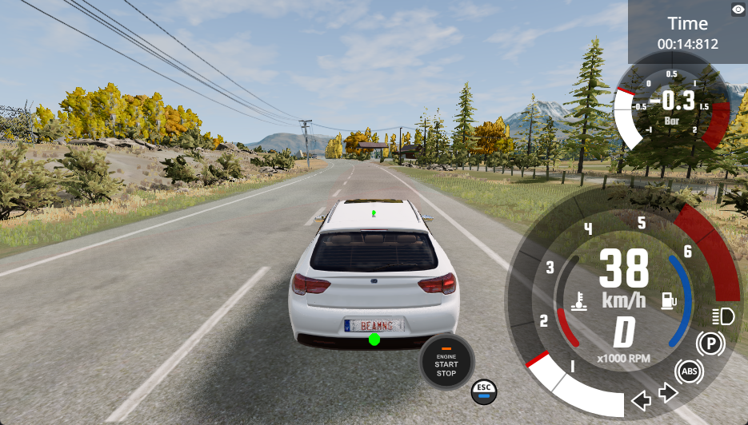

# ADAS Prototype — **ACC + AEB + LKA** in BeamNG.tech

A research prototype of an Advanced Driver Assistance System built on top of
[BeamNG.tech](https://documentation.beamng.com/beamng_tech/), simulating a vehicle
that keeps its lane using a forward-facing camera + classical computer vision pipeline.

**Status (v1.0):** Lane Keeping Assistant works.
ACC / AEB / CREEP states are implemented but currently rely on a radar that needs
further tuning - they are on the v1.1 roadmap.

**Note:** BeamNG.tech ships with a [built-in LKA module][beamng-lka].
This project reimplements lane keeping from scratch (camera → CV pipeline
→ controller) as a learning exercise — the goal was to build the full
perception-to-actuation stack, not just configure a black-box module.

[beamng-lka]: https://documentation.beamng.com/beamng_tech/adas_features/lane_keeping_assist/_index_en/

---

## Highlights

| Metric | Value |
|---|---|
| Lane detection validity | **99%** of ticks at 35 km/h |
| Lane offset stdev | **6.7 cm** from lane center (35 km/h) |
| Control loop frequency | **50 Hz** |
| Visualization frequency | 20 Hz (throttled, ~5–10 ms per frame) |
| Unit tests | **22 passing** on pure control logic |

---

## Demo 




The visualizer shows, in real time:
- Front camera with steering correction arrow
- Bird's-eye view with detected lane polynomials
- Status panel (speed, state, lane validity, offset, steering, throttle, brake)
- Lane position bar - color-coded zones (green / yellow / red) with the ego vehicle marker

Run with `python "adas-v1.01 (visualizer).py" --visualize` to enable.

---

## Architecture

```
                ┌─────────────────┐
                │  BeamNG.tech    │
                │   simulator     │
                └────────┬────────┘
                         │ sensors
        ┌────────────────┼─────────────────┐
        ▼                ▼                 ▼
   ┌─────────┐    ┌─────────────┐    ┌──────────┐
   │ Camera  │    │ Radar / US  │    │ State /  │
   │ 640×360 │    │   sensors   │    │ Electrics│
   └────┬────┘    └──────┬──────┘    └────┬─────┘
        ▼                ▼                 ▼
   ┌─────────┐    ┌─────────────┐    ┌──────────┐
   │  Lane   │    │ Distance,   │    │  Speed,  │
   │detection│    │ TTC,        │    │  pose    │
   │pipeline │    │ leader info │    │          │
   └────┬────┘    └──────┬──────┘    └─────┬────┘
        │                │                 │
        └────────────────┼─────────────────┘
                         ▼
                  ┌─────────────┐
                  │ Measurements│ (per-tick snapshot)
                  └──────┬──────┘
                         ▼
                  ┌─────────────┐
                  │   State     │  CRUISE/FOLLOW/AEB/
                  │   machine   │  CREEP/STOP
                  └──────┬──────┘
                         ▼
                  ┌─────────────┐
                  │  Per-state  │  PID + LPF + slew rate
                  │ controllers │  + gain scheduling
                  └──────┬──────┘
                         ▼
                 vehicle.control()
```

The system is split into clear layers:

- **Perception** — `lane_detection.py`: ROI → perspective transform (bird's-eye) →
  HLS binarization → sliding window → 2nd-degree polynomial fit → sanity checks →
  lane offset in meters.
- **Sensor fusion** (light) — `ADASController.measure()`: combines camera-based
  lane offset with radar/ultrasonic distance into a single `Measurements` snapshot.
- **State machine** — `next_state()` pure function: CRUISE / FOLLOW / AEB / CREEP / STOP
  with confirm-tick logic and hysteresis to avoid flapping.
- **Control** — `compute_steering()` and per-state throttle/brake controllers,
  built on a generic `PIDController` with anti-windup and bounded output.

---

## Lane keeping pipeline

```
camera frame (RGB)
    │
    ▼
ROI crop (45–95% of frame height) - removes sky and hood
    │
    ▼
Perspective transform (calibrated SRC_POINTS_FRAC)
    │
    ▼  bird's-eye view (400×400)
HLS binarization (white + yellow ranges)
    │
    ▼
Sliding window or prior-based search
    │
    ▼
np.polyfit degree 2 - for each line
    │
    ▼

Sanity checks:
  - parallelism (a coeffs close enough)
  - lane width within [0.3×BEV, 1.5×BEV]
  - |offset| < lane_width / 2
  - |Δoffset| < MAX_JUMP between frames

    │
    ▼  
	if a line is missing/weak: fallback
	→ reconstruct from the strong line + lane_width prior

    │
    ▼
lane_offset_m (signed: + = vehicle right of center)
```

The fallback was added after observing that the dashed center divider often
produces fewer pixels than the solid right edge — the detector keeps a smoothed
`lane_width_px_prior` and uses it to reconstruct the weaker line geometrically.

---

## Project evolution

| Version | What changed | Key result |
|---|---|---|
| **v0.1–v0.2, legacy** | First prototype, single `while True` loop on `tech_ground` map, ACC + AEB inline | It is kinda working, but it's harder to extend. |
| **v0.3–v0.4, legacy** | State machine introduced, PD steering keeping `ego_x = 0` (world coordinate) | Worked, but locked to one specific map and spawn point. |
| **v0.5** | Refactor into classes, dataclasses, 22 unit tests, named constants in `Config` | Clean foundation. Same behavior, much easier to extend. |
| **v1.0 (beta)** | Camera + lane detection pipeline + PID with LPF / slew rate / gain scheduling | **Lane keeping works.** 6.7 cm stdev at 35 km/h. |
| **v1.0.1 (beta w/ visualizer)** | Real-time visualization in a separate window | Same behavior, but you can see how it works under the hood. |
| **v1.1 (planned)** | Radar properly configured (narrow FOV instead of default ±34°), ACC and AEB re-enabled | TBD |

---

## Notable engineering moments

These are bugs and dead-ends worth describing - they shaped how the system
ended up being built.

### Steering sign - twice inverted

Early on, the PD controller used `error = ego_x` and worked, because on
`tech_ground` the vehicle spawned at world origin. Switching to lane-relative
control (`error = lane_offset_m`) and then to a new map flipped the effective
sign of feedback: the vehicle accelerated away from center instead of returning
to it. Diagnosis was done not by reasoning about coordinate frames, but by
looking at the CSV — `offset` and `steering` had the same sign across every
sample, which only happens with positive feedback. One minus sign fixed it.

### "PID feels worse than PD" - the D-term amplifies sensor noise

After tuning gain scheduling, steering still felt jittery at speed: Δsteer was
oscillating ~6% of full range every tick. The cause: `lane_offset_m` is computed
from a noisy CV pipeline, with frame-to-frame jumps of 0.1–0.2 m. The D-term
divides this jump by `dt = 0.02 s`, producing huge derivative values that swing
the output between extremes. The fix was to **almost remove D** (`KD = 0.05`)
and increase the output low-pass filter time constant. Effectively the system
became a PI + strong output LPF.

Lesson: D works well on **smooth** signals. On noisy ones, it works against you.

### Radar "phantoms" turned out to be the asphalt

Initially the radar was giving false positives at ~1.6 m distance, causing
spurious braking. Turning the radar to point straight up was used as a workaround.
Eventually a diagnostic script (`radar_inspect.py`) showed that the radar returns
~36,000 ray hits per tick — not curated detections — with a default field of view
of ±34° in both axes. The closest hits were just the road surface in front of the
bumper. The proper fix is two-layer:
- Configure the sensor with realistic FOV (`field_of_view_y=6`, `half_angle_deg=12`),
- Filter remaining rays by elevation / azimuth / intensity before using `argmin`.

This is queued for v1.1.

---

## CREEP - slow approach to a stopped target

CREEP is a state that activates when the vehicle is fully stopped, the radar
sees a target very close, and that target is not moving. Instead of holding the
brake forever (which would prevent merging into traffic when the lead car eventually
moves), CREEP runs a small PI controller that targets a low cruise speed (~5 km/h),
inching forward while monitoring the front ultrasonic sensor. If the gap closes
to `US_STOP_DIST` it goes back to STOP; if the lead vehicle moves away, it
returns to FOLLOW.

This was something I wanted from a real ADAS - the smooth "follow the car ahead
in stop-and-go traffic" behavior - so I built it directly into the state machine.

---

## How to run

### Prerequisites

- **BeamNG.tech** v0.38.5 (research version, not consumer BeamNG.drive)
- Python 3.10+
- Python packages from requirements.txt

### Install Python dependencies

```bash
pip install -r requirements.txt
```

### Run

```bash
# Without visualization (lighter on CPU)
python "adas-v1.01 (visualizer).py"

# With visualization window
python "adas-v1.01 (visualizer).py" --visualize
```

By default the script starts BeamNG, loads `automation_test_track`, spawns the
ego at a known straight section, and engages CRUISE at the target speed defined
in `Config.TARGET_SPEED`.

Press Ctrl+C in the terminal to stop. The full per-tick log is written to
`adas_log.csv`.

---

## Project structure

```
"adas-v1.01 (visualizer).py"		Main entry point — controller, state machine, main loop
lane_detection.py     				Lane detection pipeline (perspective transform, sliding window, polyfit)
visualizer.py         				Real-time visualization (cv2.imshow + composite layout)

# tests\camera_test:
test_adas.py          				Unit tests for pure logic (PID, state transitions, helpers)
camera_test.py        				Captures sample frames for offline calibration
calibrate.py          				Visualizes every step of the lane pipeline on a single image

# tests\radar_debug:
radar_inspect.py      				One-shot diagnostic: what does radar.poll() actually return?
radar_verify.py       				Tests elevation/azimuth/intensity filters on radar data
radar_find_doppler.py 				Identifies which column of radar output is the Doppler signal
radar_signature.py    				Prints the actual Python signature of the Radar() constructor

adas_log.csv          				(generated) per-tick log of every measurement and control output
```

---

## Limitations

- Lane detection calibration (`SRC_POINTS_FRAC`) is hand-tuned for the specific
  camera mounted on this vehicle on this map. Different cameras / maps need
  re-calibration via `camera_test.py` + `calibrate.py`.
- The pipeline assumes road markings are present and reasonably visible.
  Faded paint, shadows or night time would degrade detection — not tested.
- Tested only on properly marked, paved roads. Off-road / gravel / unmarked roads are
  out of scope.
- v1.0 disables the radar via a workaround (`dir=(0,0,1)`). ACC/AEB states exist
  in code and are tested by unit tests, but won't trigger in practice until v1.1
  with properly configured radar.
- Steering coefficients were tuned at 9–40 km/h. At 60+ km/h gain scheduling
  reduces KP, but no extensive testing was done at highway speeds yet.

---

## Tech stack

- **Simulator:** BeamNG.tech v0.38.5
- **Python:** 3.10+
- **BeamNG bridge:** [beamngpy](https://github.com/BeamNG/BeamNGpy)
- **Computer vision:** OpenCV (perspective transform, HLS binarization, drawing)
- **Numerics:** NumPy (polyfit, masking, array operations)
- **Visualization:** OpenCV `imshow` with manual composite layout (no extra GUI deps)
- **Testing:** plain `unittest` (no external runner)
- **Data:** Python `csv` for logs, dataclasses for typed config and measurements

---

## What's next (v1.1+)

- Properly configured radar (narrow FOV + post-filter by elevation/azimuth/intensity)
- Re-enable ACC and AEB in real driving scenarios
- Test on curved roads at highway speed (60+ km/h)
- Lane change as a separate state
- Possibly: replace classical CV pipeline with a lightweight neural lane detector
  when the classical approach hits its limits (e.g. faded paint, night driving)

---

## License

The code in this repository (controller, lane detection pipeline, visualizer,
tests) is a personal research project. Code is provided as-is; no warranty.

This project is intended for **academic and personal-research use** as a client
to BeamNG.tech. It does not include, redistribute, or modify any part of
BeamNG.tech — the simulator must be installed separately under its own
[BeamNG.tech academic license](https://beamng.tech/).

BeamNG.tech and BeamNG.drive are trademarks of BeamNG GmbH.


